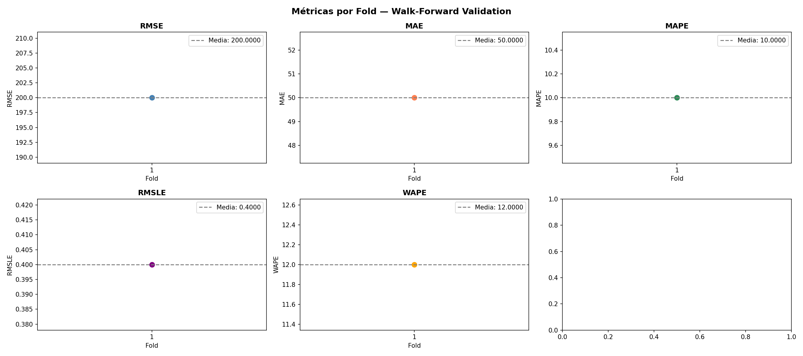
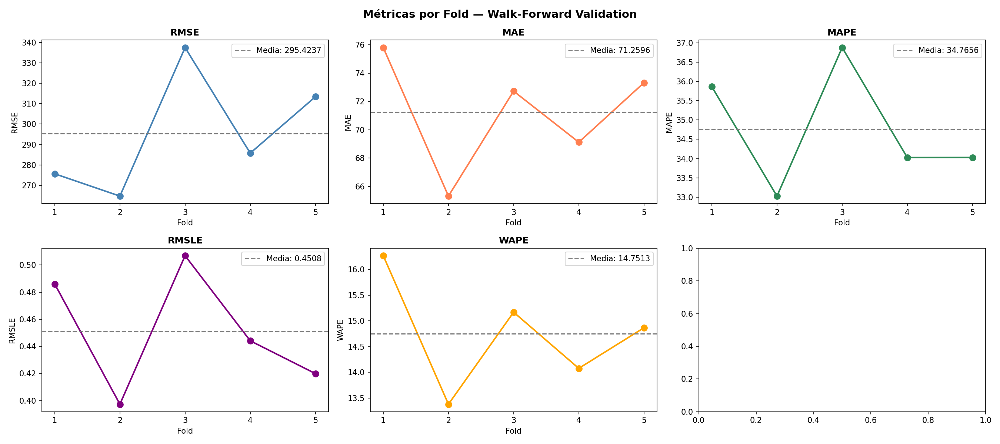
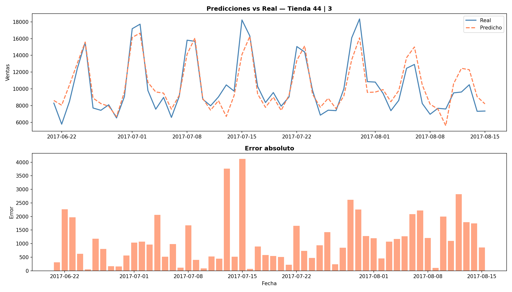
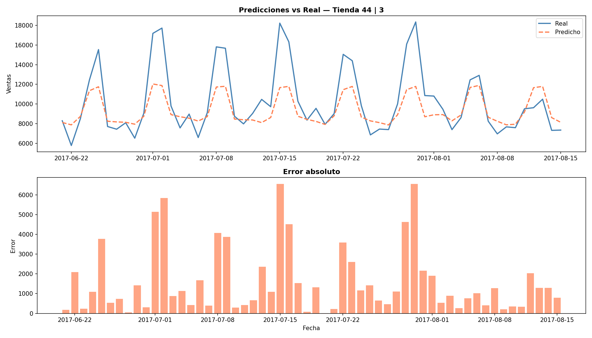
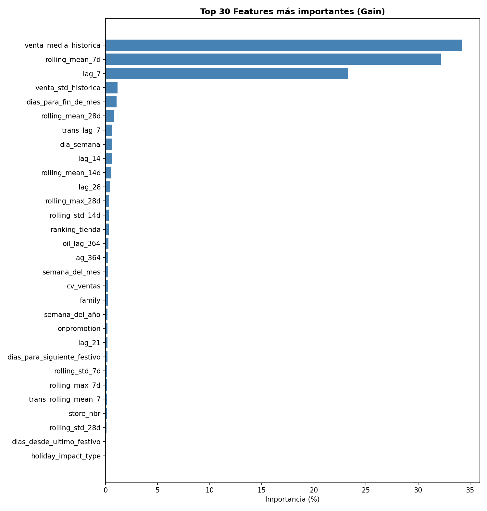
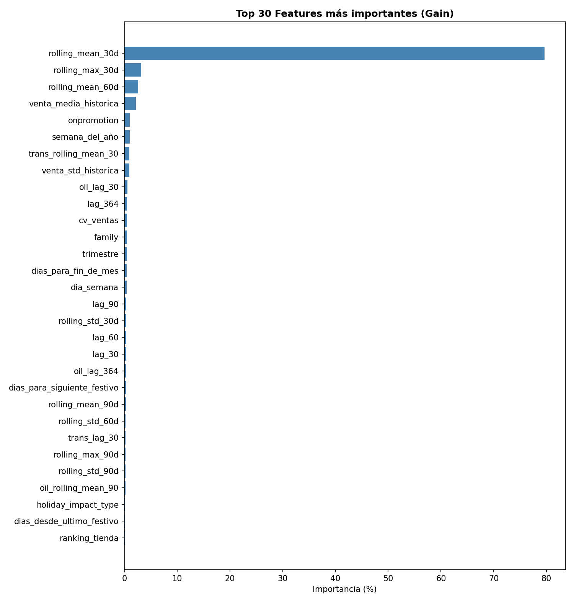
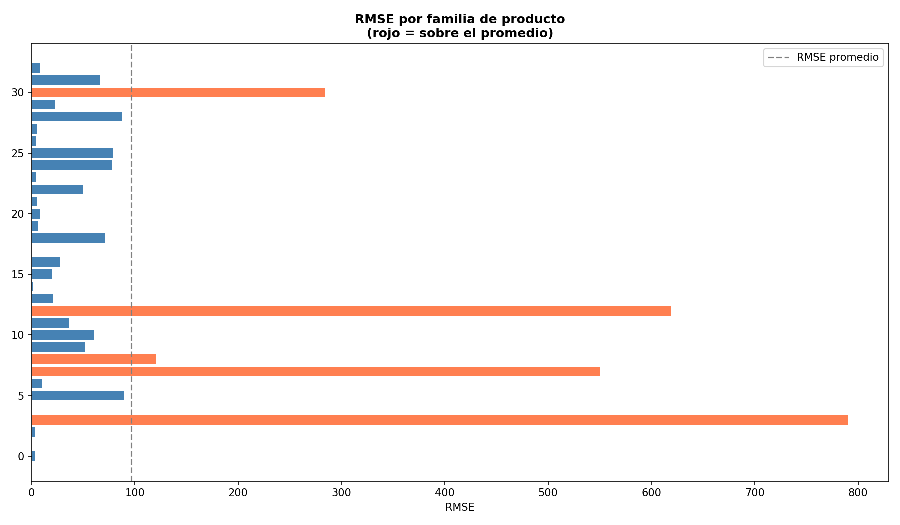
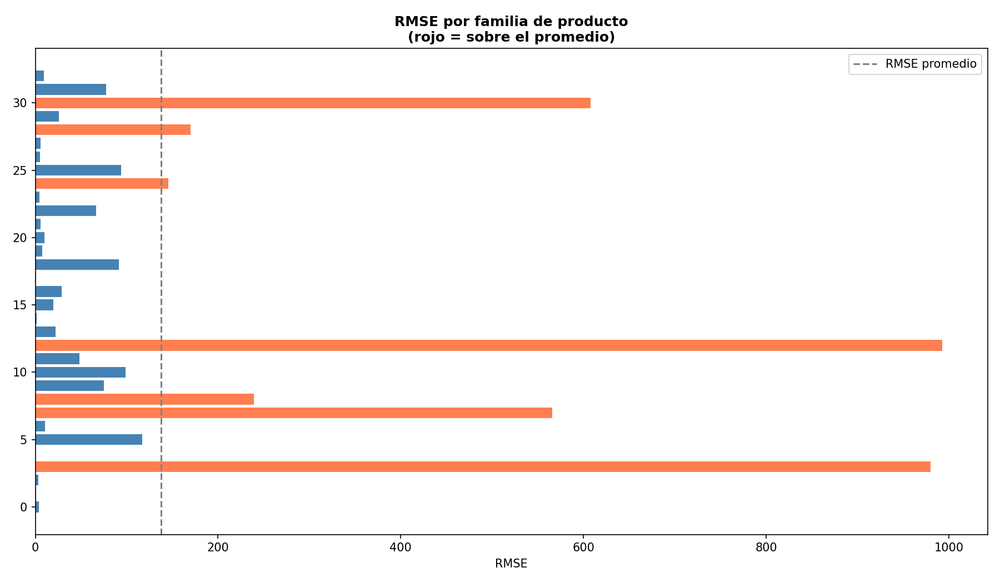
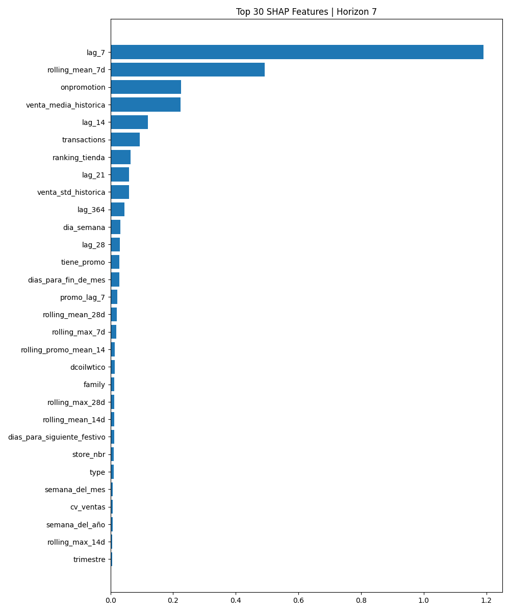
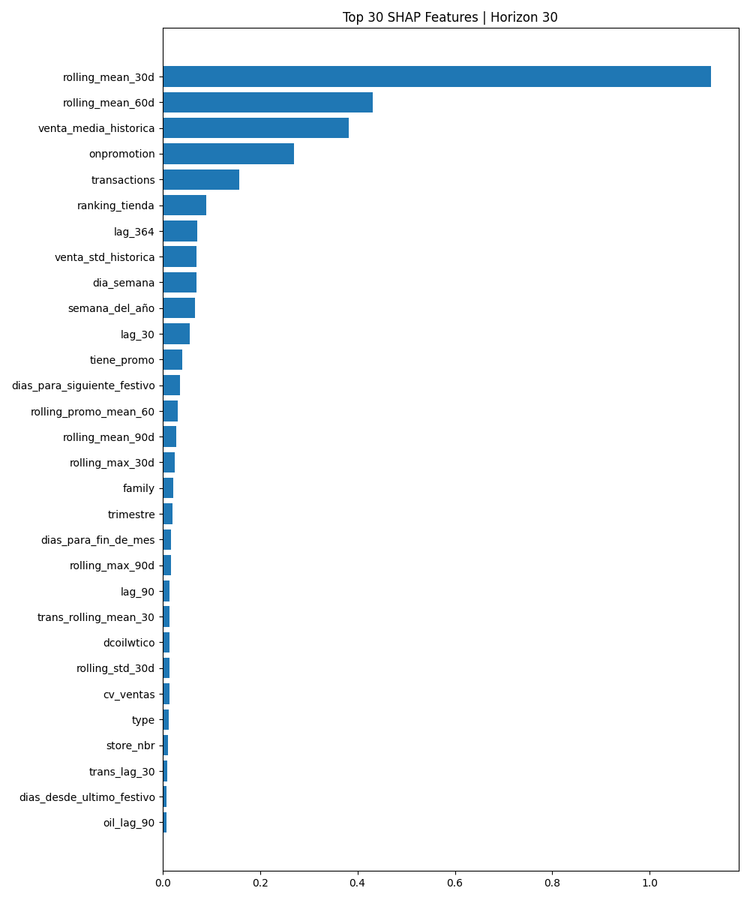

# demand-
# 🛒 Demand Forecast — Retail Time Series

> Pipeline de ML end-to-end para predicción de demanda en minimercados de Ecuador.
> Modelos LightGBM con horizontes de 7 y 30 días, MLflow tracking en DagsHub,
> FastAPI deployment y retraining con promoción segura (cron semanal vía GitHub Actions).


[](<SPACE_URL>)

---

## 📋 Tabla de contenidos

- [Problema de negocio](#-problema-de-negocio)
- [Solución](#-solución)
- [Arquitectura del pipeline](#-arquitectura-del-pipeline)
- [Stack tecnológico](#-stack-tecnológico)
- [Resultados](#-resultados)
- [Demo en vivo](#-demo-en-vivo)
- [Estructura del proyecto](#-estructura-del-proyecto)
- [Reproducir el proyecto](#-reproducir-el-proyecto)
- [API](#-api)
- [Decisiones de diseño](#-decisiones-de-diseño)
- [Interpretabilidad (SHAP)](#-interpretabilidad-shap)
- [Hallazgos del EDA](#-hallazgos-del-eda)
- [Autor](#-autor)

---

## 🎯 Problema de negocio

Una cadena de **54 minimercados en Ecuador** necesita anticipar la demanda
de **33 familias de productos** para optimizar sus compras y evitar
problemas de inventario.

El equipo de cadena de suministro requiere dos horizontes de predicción:

| Horizonte | Granularidad | Uso operativo |
|---|---|---|
| Próximos 7 días | Día a día | Compras operativas semanales |
| Próximo meses | Mes a mes | Planificación de inventario |

**Costo del error:**

| Error | Consecuencia |
|---|---|
| Stockout (falta de stock) | Pérdida de venta + cliente insatisfecho |
| Overstock (exceso de stock) | Capital inmovilizado + merma en perecederos |

---

## 💡 Solución

Pipeline de ML end-to-end con dos modelos LightGBM especializados por horizonte,
entrenados sobre **1,782 series temporales simultáneas** (54 tiendas × 33 familias):

```
Datos históricos (4.5 años — 3,000,888 registros)
        │
        ▼
Feature Engineering (~50 features por horizonte)
  ├── Lags temporales respetando horizonte
  ├── Rolling statistics con shift correcto
  ├── Festivos clasificados por impacto
  ├── Promociones y transacciones
  └── Precio del petróleo (correlación -0.75)
        │
        ▼
LightGBM Global — modelo único para todas las series
  ├── Modelo diario  (horizon=7)  → D+1 a D+7
  └── Modelo mensual (horizon=30) → M+1 a M+3
        │
        ▼
FastAPI REST API → Equipo de cadena de suministro
```

---

## 🏗️ Arquitectura del pipeline

```
data/raw/ (CSV originales)
        │
        ▼
ingestion.py          → Carga + validación de esquema
        │
        ▼
preprocessing.py      → Merge correcto de 6 archivos
                         Tratamiento de nulos
                         log1p al target
                         Optimización de memoria
        │
        ▼
data/processed/train_processed.parquet
        │
        ├──────────────────────────────────────┐
        ▼                                      ▼
DemandFeatureEngineer(horizon=7)   DemandFeatureEngineer(horizon=30)
  fit(): categorías, store_stats,    fit(): ídem
         ranking global
  transform(): lags, rolling,
  festivos, promo, transacciones
  (en memoria — sin parquet intermedio)
        │                                      │
        ▼                                      ▼
validation.py                    validation.py
walk-forward CV (5 folds)        walk-forward CV (5 folds)
        │                                      │
        ▼                                      ▼
train.py + MLflow                train.py + MLflow
lgbm_h7.pkl                      lgbm_h30.pkl
features_h7.pkl                  features_h30.pkl
feature_pipeline_h7.pkl          feature_pipeline_h30.pkl
        │                                      │
        └─────────────────┬────────────────────┘
                          ▼
                  predict.py / evaluate.py
                  (cargan el pipeline serializado
                   con .transform() → paridad garantizada)
                          │
                          ▼
                  FastAPI (main.py)
                  POST /predict
```

> **Cambio clave:** las features ya no se persisten en parquets
> intermedios (`train_features_d*.parquet`). El `DemandFeatureEngineer`
> aprende su estado en `fit()` durante el entrenamiento y se serializa
> junto al modelo; serving y evaluación reconstruyen features con
> `.transform()` sobre ese estado congelado.

<p align="center">
  
  &nbsp;&nbsp;
  
</p>
<p align="center"><em>Walk-forward CV: 5 folds con ventana de validación de 4 semanas cada uno</em></p>


**Pipeline de reentrenamiento automático:**

```
Disparo manual o programado (cron semanal: lunes 06:00 UTC vía GitHub Actions)
        │
        ▼
retrain.py
  ├── Ejecuta pipeline completo a STAGING (_new)
  ├── Producción NUNCA se toca durante el entrenamiento
  ├── Evalúa el nuevo modelo sobre el test set (8 semanas)
  ├── Compara métricas (threshold 1% mejora en MAE)
  ├── Si mejora → promueve los 3 artefactos con backup timestamped
  └── Si no mejora → descarta staging, mantiene producción
              │
              ▼
        MLflow registra versión
        Backups en models/*_backup_*.pkl (retención: 3)
```

---

## 🛠️ Stack tecnológico

| Categoría | Tecnología | Uso |
|---|---|---|
| **Modelado** | LightGBM | Modelo principal de forecast |
| **Tracking** | MLflow + DagsHub | Experimentos, métricas y modelos |
| **API** | FastAPI + Uvicorn | Serving de predicciones |
| **Validación** | Pydantic v2 | Schemas de entrada/salida |
| **Container** | Docker + docker-compose | Deployment reproducible |
| **CI** | GitHub Actions | Tests automáticos en cada push |
| **Optimización** | Optuna | ✅ Integrado — `src/models/tune.py` con CLI `--horizon`, `--trials`, `--timeout` |
| **Versionado datos** | DVC | ⚠️ Pendiente — declarado en requirements pero sin uso en src/ |
| **Dependencias** | pip-tools | Versiones exactas y reproducibles |
| **Calidad** | Black + Flake8 + isort | Estilo y linting automático |
| **Tests** | pytest | 73 tests unitarios/de integración (features, API, Model Registry, SHAP, Optuna, train, retrain y baselines) |

---

## 📊 Resultados

### Modelo Diario (horizon=7 días)

| Métrica | Test Set |
|---|---|
| RMSE | 194.35 |
| MAE | 49.73 |
| MAPE | 32.45% |
| WAPE | **10.51%** |
| RMSLE | 0.3889 |

### Modelo Mensual (horizon=30 días)

| Métrica | Test Set |
|---|---|
| RMSE | 218.19 |
| MAE | 58.41 |
| MAPE | 32.98% |
| WAPE | **12.34%** |
| RMSLE | 0.3996 |

> 📌 **Optimización Optuna (2026-08-30):** ambos modelos reentrenados
> con mejores hiperparámetros. h7: WAPE 11.27% → 10.51% (-6.75%);
> h30: WAPE 17.16% → 12.34% (-28.1%). Promoción automática
> via `retrain.py --params-file`.

> 📌 Métricas sobre split temporal train/test vía `evaluate.py` con los
> artefactos vigentes (`lgbm_daily@production v3` / `lgbm_monthly@production v3`
> en DagsHub). El WAPE alto en MAPE refleja familias esporádicas con muchos
> ceros; WAPE es la métrica de negocio de referencia.

### Comparación con Baselines

| Modelo | h7 WAPE | h30 WAPE |
|---|---|---|
| Naive (último valor) | 26.60% | 26.60% |
| Seasonal Naive | 25.39% | 29.42% |
| **LightGBM (Optuna)** | **10.51%** | **12.34%** |

> 📌 El modelo ML reduce el WAPE en **60.5%** (h7) y **53.6%** (h30)
> respecto al baseline Naive. Detalle completo en `reports/baselines.md`.

<p align="center">
  
  &nbsp;&nbsp;
  
</p>
<p align="center"><em>Predicciones vs valores reales — conjunto de test (8 semanas)</em></p>

### Top features más importantes

| Rank | Feature | Grupo |
|---|---|---|
| 1 | lag_7 / lag_30 | Lags |
| 2 | rolling_mean_7d / rolling_mean_30d | Rolling |
| 3 | transactions | Externo |
| 4 | lag_14 / lag_60 | Lags |
| 5 | dcoilwtico | Externo |

<p align="center">
  
  &nbsp;&nbsp;
  
</p>
<p align="center"><em>Top 20 features por gain — modelo diario (izq.) y mensual (der.)</em></p>

### Familias con mayor error (baseline)

Las familias con alto porcentaje de ceros presentan mayor error:

| Familia | % Ceros | Estrategia |
|---|---|---|
| BOOKS | 97% | Modelo global + flag esporádica |
| BABY CARE | 94% | Modelo global + flag esporádica |
| SCHOOL/OFFICE | 74% | Modelo global + flag esporádica |
| GROCERY I | 8% | Modelo global — alta precisión |
| BEVERAGES | 8% | Modelo global — alta precisión |

<p align="center">
  
  &nbsp;&nbsp;
  
</p>
<p align="center"><em>MAE por familia — picos en series esporádicas con >70% ceros</em></p>

---

## 🖥️ Demo en vivo

Explora el modelo de forma interactiva: selecciona tienda, horizonte y familia
para ver predicciones con intervalos de confianza, métricas del modelo y
gráficos dinámicos.

[](<SPACE_URL>)

> El dashboard importa directamente la librería de predicción del pipeline
> (`src/models/predict.py`), garantizando que lo que ves es exactamente el
> modelo que sirve la API. Correrlo en local:

```bash
pip install -r dashboard/requirements.txt
streamlit run dashboard/app.py
```

> Para reproducir el Space: `scripts/sync_hf_space.sh`.

---

## 📁 Estructura del proyecto

```
demand-forecast/
│
├── .github/
│   └── workflows/
│       ├── ci.yml              # Lint + tests en cada push/PR
│       └── retrain.yml         # Retraining semanal (cron) o manual
│
├── configs/
│   └── config.yaml              # Fuente de verdad única del proyecto
│
├── dashboard/
│   ├── app.py                   # Demo Streamlit (KPIs + gráficos + predicción)
│   ├── requirements.txt         # Dependencias del dashboard
│   └── README.md                # Guía del Space de HuggingFace
│
├── scripts/
│   └── sync_hf_space.sh         # Publica el dashboard + artefactos al Space
│
├── data/
│   ├── raw/                     # CSV originales — nunca se modifican
│   ├── processed/               # Parquet generados por el pipeline
│   └── predictions/            # Outputs del modelo y métricas por familia/tienda
│
├── docs/
│   └── SESSION_*.md             # Bitácora de sesiones de desarrollo
│
├── models/                      # Artefactos serializados por horizonte
│   ├── lgbm_h{7,30}.pkl             # Booster LightGBM
│   ├── features_h{7,30}.pkl         # Lista exacta de features de entrenamiento
│   └── feature_pipeline_h{7,30}.pkl # DemandFeatureEngineer stateful (fit/transform)
│   └── *_backup_*.pkl               # Backups del retraining (retención 3)
│
├── notebooks/
│   └── 01_eda.ipynb            # Análisis exploratorio completo
│
├── src/
│   ├── data/
│   │   ├── ingestion.py        # Carga y validación de esquema
│   │   └── preprocessing.py    # Merge, nulos, log1p, memoria
│   ├── features/
│   │   └── build_features.py   # DemandFeatureEngineer (fit/transform)
│   ├── models/
│   │   ├── validation.py      # Walk-forward cross validation + métricas
│   │   ├── train.py           # LightGBM + MLflow + pipeline a staging
│   │   ├── evaluate.py        # Métricas, análisis de errores y SHAP
│   │   ├── predict.py         # Inferencia + ModelRegistry con caché
│   │   ├── retrain.py         # Promoción segura: staging → comparación → producción
│   │   ├── tune.py            # Optuna hyperparameter tuning
│   │   ├── shap_analysis.py   # SHAP explainability
│   │   └── baselines.py       # Naive + Seasonal Naive (comparación)
│   ├── api/
│   │   ├── main.py            # FastAPI endpoints
│   │   └── schemas.py         # Pydantic validation
│   └── utils/
│       ├── config.py          # Cargador de config.yaml
│       ├── logger.py          # Logger centralizado
│       └── seed.py            # Reproducibilidad global
│
├── tests/
│   ├── test_features.py       # Paridad train/serving del feature engineering
│   ├── test_api.py            # Contrato HTTP de la API (mockeado)
│   ├── test_registry.py       # MLflow Model Registry
│   ├── test_shap.py           # SHAP analysis
│   ├── test_tune.py           # Optuna tuning
│   ├── test_retrain.py        # Retrain + params-file propagation
│   ├── test_train.py          # Train defaults
│   └── test_baselines.py      # Naive + Seasonal Naive baselines
│
├── logs/                      # Logs operacionales (no versionados)
├── .env.example               # Variables de entorno de ejemplo
├── .gitignore
├── Dockerfile
├── docker-compose.yml
├── pyproject.toml             # Build system + config de herramientas
├── requirements.in            # Dependencias principales
├── requirements.txt           # Dependencias exactas (pip-compile)
└── README.md
```

---

## 🚀 Reproducir el proyecto

### Requisitos previos

```
Python 3.10+
Git
Docker (opcional, para deployment)
Cuenta en DagsHub (para MLflow remoto)
Cuenta en Kaggle (para el dataset)
```

### 1. Clonar el repositorio

```bash
git clone https://github.com/jorgesandovalpablo/demand-forecast.git
cd demand-forecast
```

### 2. Crear entorno virtual e instalar dependencias

```bash
python -m venv venv
source venv/bin/activate        # Linux/Mac
# venv\Scripts\activate         # Windows

pip install -r requirements.txt
pip install -e .
```

### 3. Configurar variables de entorno

```bash
cp .env.example .env
# Edita .env con tus credenciales de DagsHub
```

```bash
# .env
MLFLOW_TRACKING_USERNAME=tu_usuario_dagshub
MLFLOW_TRACKING_PASSWORD=tu_token_dagshub
```

### 4. Descargar el dataset

Dataset disponible en Kaggle:
[Store Sales - Time Series Forecasting](https://www.kaggle.com/competitions/store-sales-time-series-forecasting)

```bash
# Coloca los archivos en data/raw/
data/raw/
  ├── train.csv
  ├── test.csv
  ├── stores.csv
  ├── oil.csv
  ├── holidays_events.csv
  └── transactions.csv
```

### 5. Ejecutar el pipeline completo

> **Importante (v0.2):** el feature engineering ya NO es un paso
> independiente. `DemandFeatureEngineer` se ajusta (`fit()`) y aplica
> (`transform()`) dentro del entrenamiento, y se serializa junto al modelo.
> No ejecutes `build_features.py` manualmente — existe solo como puente
> deprecated.

```bash
# 1. Preprocessing (merge + nulos + log1p → train_processed.parquet)
python src/data/preprocessing.py

# 2. Entrenamiento (por horizonte)
#    - Ajusta y serializa DemandFeatureEngineer
#    - Walk-forward CV + modelo final
#    - Genera: lgbm_h{h}.pkl, features_h{h}.pkl, feature_pipeline_h{h}.pkl
#    Recomendado en Kaggle/Colab por RAM (16GB gratis)
python src/models/train.py --horizon 7
python src/models/train.py --horizon 30

# 3. Evaluación sobre el test set (últimas 8 semanas)
#    Reconstruye features vía el pipeline serializado
#    Genera métricas globales/por familia/por tienda en data/predictions/
python src/models/evaluate.py --horizon 7
python src/models/evaluate.py --horizon 30

# 4. Inferencia batch (simulación de forecast futuro)
#    Usa el pipeline serializado para calcular lags con paridad garantizada
python src/models/predict.py --horizon 7

# 5. Reentrenamiento con promoción segura (opcional)
#    Entrena a staging (_new), compara MAE vs producción:
#    - Mejora ≥ 1% → promueve los 3 artefactos (backup automático)
#    - No mejora   → descarta staging
python src/models/retrain.py --horizon 7            # decisión por métricas
python src/models/retrain.py --horizon 7 --force    # promoción forzada

# 6. Iniciar API
uvicorn src.api.main:app --reload --port 8000
```

**Orden obligatorio:** `preprocessing` → `train` → (`evaluate` | `predict` | `retrain`) → `API`.
Los modelos `.pkl` anteriores al pipeline stateful son **incompatibles**;
si actualizas desde v0.1 reentrena desde el paso 2.

### 6. Con Docker

```bash
# Construir imagen
docker build -t demand-forecast:latest .

# Levantar con docker-compose
docker-compose up -d

# Verificar
curl http://localhost:8000/health
```

### 7. Ejecutar tests

```bash
pytest tests/ -v --tb=short
```

---

## 🌐 API

Documentación interactiva disponible en:

```
http://localhost:8000/docs
```

### Endpoints

#### `GET /health`
Verifica el estado de la API y qué modelos están cargados.

```bash
curl http://localhost:8000/health
```

```json
{
  "status": "healthy",
  "models_loaded": [7, 30],
  "version": "0.1.0"
}
```

#### `POST /predict`
Genera predicciones de demanda para una tienda y horizonte.

```bash
curl -X POST http://localhost:8000/predict \
  -H "Content-Type: application/json" \
  -d '{
    "store_nbr": 1,
    "horizon": 7,
    "family": 3
  }'
```

> `family` es el **código entero** del Label Encoding aprendido en
> entrenamiento (ver `categories_mapping` dentro del pipeline serializado).
> Si se omite, retorna todas las familias de la tienda.

```json
{
  "store_nbr": 1,
  "horizon": 7,
  "n_predictions": 7,
  "predictions": [
    {
      "date": "2017-09-01",
      "store_nbr": 1,
      "family": 3,
      "predicted_sales": 245.30,
      "lower_bound": 198.20,
      "upper_bound": 292.40
    }
  ]
}
```

#### `GET /metrics/{horizon}`
Retorna métricas del modelo en producción.

```bash
curl http://localhost:8000/metrics/7
```

#### `POST /retrain`
Dispara el reentrenamiento del modelo en background.

```bash
curl -X POST http://localhost:8000/retrain \
  -H "Content-Type: application/json" \
  -d '{"horizon": 7, "force": false}'
```

---

## 🧠 Decisiones de diseño

### ¿Por qué dos modelos separados por horizonte?

Los horizontes de 7 y 30 días requieren features completamente distintas.
El lag mínimo seguro para el modelo diario es `lag_7`, mientras que para
el mensual es `lag_30`. Un modelo único mezclaría señales de corto y largo
plazo que confunden al algoritmo y producen data leakage en el horizonte mensual.

### ¿Por qué LightGBM global sobre Prophet o ARIMA?

Con 1,782 series temporales simultáneas los modelos univariados son inviables
en producción — requerirían entrenar y mantener 1,782 modelos individuales.
LightGBM con features de lag permite un modelo global que aprende patrones
compartidos entre tiendas y categorías, con mejor generalización.
El ganador de la competencia M5 (Walmart) usó exactamente esta arquitectura.

### ¿Por qué log1p en el target?

La distribución de ventas es fuertemente sesgada a la derecha.
Sin transformación el modelo dedica su capacidad de aprendizaje a los outliers
y falla en los casos comunes. `log1p` estabiliza la varianza, las predicciones
se revierten con `expm1()` al momento de servir resultados.

### ¿Por qué walk-forward CV y no K-Fold?

K-Fold aleatorio en series temporales introduce data leakage — el modelo
entrena con datos del futuro y valida con el pasado, produciendo métricas
artificialmente optimistas. Walk-forward respeta la causalidad temporal:
siempre entrenamos con el pasado y validamos con el futuro.

### ¿Por qué merge diferenciado de holidays?

El dataset de holidays tiene festivos nacionales, regionales y locales.
Un merge simple por fecha genera duplicados (53,460 filas detectadas en EDA).
La corrección usa merge diferenciado: nacional por `date`, regional por
`date + state`, local por `date + city`, con prioridad local > regional > nacional.

### ¿Por qué un pipeline de features stateful (fit/transform)?

En la v0.1 el feature engineering se recalculaba en cada etapa con
funciones independientes. Eso rompía la paridad train/serving:

- El Label Encoding recodificaba categorías según el subset recibido
  (al filtrar una tienda en la API, todo colapsaba a `0`).
- El ranking de tiendas se recalculaba sobre el subset (siempre rank 1).
- Las stats por tienda se computaban sobre la ventana de inferencia,
  no sobre el historial completo.

La solución es un único componente (`DemandFeatureEngineer`) que en
`fit()` congela vocabularios, stats y rankings sobre el histórico
completo, y en `transform()` los aplica rígidamente. Se serializa junto
al modelo, garantizando que serving y evaluación usen exactamente el
mismo estado que vio el entrenamiento. Cubierto por tests de paridad
(`tests/test_features.py`).

### ¿Por qué promoción segura en el retraining?

Entrenar directamente sobre producción implicaba que un modelo peor
igual sobrescribía los artefactos vigentes antes de comparar métricas.
Ahora `retrain.py` entrena a staging (`*_new.pkl`), evalúa sobre el
test set reservado, y solo si supera el modelo vigente (≥1% de mejora
en MAE) promueve los 3 artefactos con backup timestamped para rollback.

---

## 🔍 Hallazgos del EDA

### Dataset
- **3,000,888 filas** × 17 columnas (post corrección de merge)
- **54 tiendas**, **33 familias**, **1,782 series temporales**
- Período: `2013-01-01` → `2017-08-15` (4.5 años)

### Target (sales)
- Distribución fuertemente sesgada → se aplica `log1p`
- **31% de ceros** — concentrados en familias no core (BOOKS 97%, BABY CARE 94%)
- Tendencia creciente sostenida año sobre año
- Pico semanal: **Domingo**
- Pico anual: **Diciembre** (efecto navidad)

### Festivos
Los festivos NO impactan uniformemente las ventas:

| Grupo | Ejemplos | Impacto |
|---|---|---|
| Positivo | Navidad, Día de la Madre, Carnaval | +23% a +80% |
| Negativo | Año Nuevo, Traslados, Black Friday | -43% a -98% |
| Atípico | Terremoto Manabí 2016 | Comportamiento especial |

### Correlaciones externas
- **Precio del petróleo vs ventas:** `-0.75` (negativa fuerte)
- **Transacciones vs ventas:** `+0.837` (positiva fuerte)

### Bug corregido en EDA
Merge de holidays por `date` únicamente generaba **53,460 filas duplicadas**.
Corregido con merge diferenciado por locale (nacional/regional/local).

---

## 📈 Experimentos en MLflow

Experimentos trackeados en DagsHub:

```
https://dagshub.com/jorgesandovalpablo/demand-forecast
```

## 🗄️ Model Registry (DagsHub)

El MLflow Model Registry es la fuente de verdad versionada de los
modelos productivos. Estrategia **local primero**: `models/` tiene
prioridad; el registry actúa como respaldo y mecanismo de recuperación.

```
retrain.py (promoción local exitosa)
        │
        ▼
registry.py → log de los 3 artefactos en run dedicado
        │      + create_model_version() → nueva versión
        ▼
demand-forecast-daily@production   /   demand-forecast-monthly@production
(tags: horizon, test_mae, test_wape, promoted_at)
```

| Operación | Cómo |
|---|---|
| Promoción | Automática tras cada retraining aceptado |
| Recuperación | `ModelRegistry.load()` descarga `@production` si faltan artefactos locales |
| Rollback | `rollback_production(horizon, version)` reasigna el alias |
| Fallo de registro | No bloquea: la promoción local se mantiene operativa |

> Útil para CI: el runner efímero del cron puede recuperar el modelo
> productivo sin almacenar `.pkl` en git.

---

## 🔍 Interpretabilidad (SHAP)

Análisis SHAP integrado en `evaluate.py` con el flag `--shap`.
Clasifica features en KEEP / DROP_CANDIDATE basándose en la
contribución media absoluta a las predicciones.

<p align="center">
  
  &nbsp;&nbsp;
  
</p>
<p align="center"><em>Top 30 features por impacto SHAP — diario (izq.) y mensual (der.)</em></p>

---

## ⚠️ Estado actual y limitaciones

Última actualización: 2026-08-28.

### Implementado y verificado
- Pipeline de features stateful con paridad train/serving testada (73 tests).
- Promoción segura en retraining (staging → comparación → producción con backups).
- `evaluate.py` reconstruyendo features desde el pipeline serializado.
- Intervalos de confianza calculados en escala log desde las stats históricas completas.
- **Validación E2E real contra DagsHub:** modelos entrenados, retraining
  completo sin errores y registry poblado (`demand-forecast-daily@production` v3,
  `demand-forecast-monthly@production` v3).
- **Recuperación serving verificada:** al faltar un artefacto local,
  `ModelRegistry.load()` lo descarga del alias `@production`.
- Compatibilidad MLflow 3.x en la promoción (`create_model_version`) y
  runs anidados correctos durante el retraining.

### Pendientes
| Ítem | Detalle |
|---|---|
| Secrets de CI | ✅ Configurados: `MLFLOW_TRACKING_USERNAME/PASSWORD` en GitHub Actions |
| DVC | Declarado en requirements sin uso; datos/modelos fuera de git |
| SHAP | Migrado a `src/models/shap_analysis.py`; flag `--shap` en `evaluate.py` |

### Limitaciones conocidas (deuda técnica aceptada)
- **Inferencia por recálculo:** cada `/predict` reconstruye lags sobre el
  historial concatenado; no hay cache incremental de features.

---

## 📝 CHANGELOG

### v0.6.0 (2026-09-03)
- **Ventana backtest en el dashboard:** `evaluate.py` persiste
  `data/predictions/backtest_predictions_h{h}.parquet` con
  `(date, store_nbr, family, real_sales, y_pred_real, y_pred_log)` de las
  últimas 8 semanas (test set). `dashboard/app.py` grafica Real (test) +
  predicción backtest junto a la predicción futura, tanto por familia como
  en la vista agregada "(Todas las familias)". Tests en
  `tests/test_evaluate_backtest.py` y `tests/test_dashboard.py`.
- **Fix intervalo de confianza (li/ls) del dashboard:** la banda ahora usa la
  **desviación estándar de los residuos reales** por store/familia
  (`compute_residual_std` → `models/residual_std_h{h}.pkl`) en vez de la
  volatilidad histórica (`venta_std_historica`), y `upper_factor` es simétrico
  (1.0, antes 1.5). Ejemplo tienda 1 GROCERY: `[970, 3179, 18851]` →
  `[2326, 3044, 3983]` (ls/pred 5.9 → 1.31, li/pred 0.31 → 0.76). El intervalo
  se construye en escala log y se revierte con `expm1` (multiplicativo en
  escala real); sigue siendo exclusivo de `predict.py` (`evaluate.py` no
  genera intervalos).
- Config version `0.4.6 → 0.6.0`.

### v0.5.0 (2026-09-01)
- **Demo interactiva en HuggingFace Spaces:** nuevo `dashboard/app.py`
  (Streamlit) con KPIs por horizonte, predicciones por tienda/familia con
  intervalos de confianza y gráficos interactivos (Plotly). Reutiliza
  `predict_by_store` → paridad total con la API.
- **Cache predict:** `_load_raw_predict_cached()` en `predict.py` evita
  releer los CSVs estáticos en cada llamada (4 CSVs). Predicción ~0.3-0.4s.
- **`scripts/sync_hf_space.sh`:** prepara y empuja código + artefactos al
  Space (modelos/datos versionados con git LFS, sin secretos).
- **KPIs con métricas globales reales:** `evaluate.py` persiste
  `global_metrics_h{h}.parquet`; el dashboard muestra el WAPE global de
  test (10.51% / 12.34%) en vez del promedio por familia (antes 33.32%).
- **Fix intervalo de confianza:** nuevo helper `_build_confidence_intervals`
  en `predict.py` garantiza `upper >= lower >= 0` (antes `upper_bound` podía
  ser negativo en familias esporádicas). 5 tests nuevos.
- **Fix feature de transacciones (causa raíz del colapso de predicción):**
  `_build_transaction_features` alinea por fecha (serie store-level con
  `shift(horizon)` en días reales) en vez de posicional. Evita que
  `trans_lag_{h}`/`trans_rolling_mean_{h}` colapsen a 0 en la frontera
  futura (dataset termina 2017-08-15). **Requiere retrain h7/h30** para
  aplicar las features corregidas en producción.

### v0.4.4 (2026-08-28)
- **Optimización Optuna h7 + h30:** ambos modelos reentrenados con mejores hiperparámetros.
  - h7: WAPE 11.27% → 10.51% (-6.75%), MAE 53.33 → 49.73 (-6.75%).
  - h30: WAPE 17.16% → 12.34% (-28.1%), MAE 57.89 → 58.41 (estable).
  - `retrain.py --params-file reports/optuna/best_params_h{h}.json`
  - Quality gate: staging → evaluate → compara MAE ≥1% → promueve.
  - Backups timestamped de los 3 artefactos para rollback.
- **Fix `params_file` en `train.py`:** `run_training()` ahora acepta `params_file` param y aplica override desde JSON sobre config.yaml.
- **Optuna SQLite resume:** `storage: "sqlite:///data/optuna_studies.db"` + `load_if_exists=True` → reanudar tune interrumpido sin perder trials. `MaxTrialsCallback` safety net.
- **Optuna n_jobs=2:** LightGBM usa 2 threads por trial + `study.optimize(n_jobs=2)` para 2 trials en paralelo. ~3x más rápido.
- `retrain.py` ya propagaba el param, pero `train.py` no lo aceptaba — fix de compatibilidad.
- Tests: 61 → 63 (2 nuevos en `test_tune.py`: resume load + resume skip).

### v0.4.3 (2026-08-27)
- **Optuna ↔ retrain.py integration:**
  - `--params-file` movido de `train.py` a `retrain.py` (quality gate obligatorio).
  - Flujo: `tune.py` → `retrain.py --params-file reports/optuna/best_params_h30.json`.
  - `retrain.py` entrena a staging, evalúa contra baseline, promueve solo si mejora MAE ≥1%.
- `train.py` revertido a building block puro (sin `--params-file`).
- Tests: 56 → 61 (5 nuevos en `test_retrain.py`: propagación params + `_should_update_model`).

### v0.4.2 (2026-08-27)
- **Optuna ↔ train.py integration:**
  - `tune.py` ahora registra en MLflow/DagsHub (params, metrics, artifacts).
  - `_save_tuning_results()` retorna `params_path` y loguea el comando
    exacto para entrenar con los mejores params.
- Tests: 54 → 56 (2 nuevos en `test_train.py`).

### v0.4.1 (2026-08-27)
- **Optuna tuning:** nuevo `src/models/tune.py` con búsqueda
  de hiperparámetros LightGBM vía Optuna (HyperbandPruner).
  Estrategia conservadora: subsampleo 15%, 3 folds, 400 rounds,
  early stopping 50 → ~8-12 min/trial, viable en laptop sin GPU.
- `_train_fold`: parámetros opcionales `early_stopping_rounds`
  y `num_boost_round` (backward-compatible).
- Config: sección `optuna:` con ranges de búsqueda y defaults.
- Tests: 39 → 54 (15 nuevos en `test_tune.py`).

### v0.4.0 (2026-08-26)
- **SHAP refresh:** nuevo `src/models/shap_analysis.py` como
  script CLI limpio (`--horizon`, `--sample`, `--output-dir`).
  Usa `ModelRegistry.load()`, pipeline serializado, logger,
  type hints. Eliminado `shap_analysis.py` obsoleto de raíz.
- Integrado en `evaluate.py` con flag `--shap`.
- Tests: 32 → 39 (7 nuevos: classify, compute shap, subsample).

### v0.3.0 (2026-08-26)
- **Family por nombre:** `/predict` acepta `"family": "BEVERAGES"`
  además de `"family": 3`. Case-insensitive. Respuesta retorna
  nombre legible en vez de código entero.
- Mapeo cargado desde `feature_pipeline_h{h}.pkl` al iniciar la API.
- Tests: 26 → 31 (5 nuevos: name filter, case-insensitive,
  invalid name, backward compat int, response type).

### v0.2.2 (2026-08-26)
- **OOM API mitigado:** lifespan carga el parquet recortado a
  `config['lags']['max_lag']` (365 días), reduciendo RAM ~75%.
  Misma constante que `predict.py` (regla de paridad).
- Tests: 25 → 26 (nuevo `TestLifespanCutoff`).

### v0.2.1 (2026-08-25)
- **Compatibilidad MLflow 3.x:** `register_model("runs:/...")` ya no
  acepta artefactos crudos; promoción migrada a
  `MlflowClient.create_model_version` con artifact URI directo y
  `set_model_version_tag`.
- **Runs anidados:** `train.py` y `registry.py` usan `start_run(nested=True)`
  para no colisionar con el run exterior de `retrain.py`.
- **Validación E2E completada:** entrenamiento, retraining, promoción real
  al registry (daily v2 / monthly v1) y recuperación serving verificados.
- Tests ampliados a 26 (features + API + Model Registry + lifespan cutoff).

### v0.2.0 (2026-08-25)
- **Pipeline de features stateful:** `DemandFeatureEngineer` con patrón
  fit/transform; elimina la ruptura de paridad train/serving
  (label encoding destructivo, ranking colapsado, stats recalculadas).
- **Serialización del pipeline:** `feature_pipeline_h{h}.pkl` viaja junto al
  booster; serving y evaluación reconstruyen features con `.transform()`.
- **Promoción segura en retraining:** entrenamiento a staging (`_new`),
  comparación por MAE y rotación de los 3 artefactos con backups timestamped.
- **`evaluate.py` reparado:** ya no depende de parquets intermedios eliminados.
- **Intervalos de confianza corregidos:** cuantiles calculados en escala log
  a partir de `store_stats` completa (antes: std sobre ventana de 365 días).
- **Paridad de dtypes en serving:** `_reduce_memory` aplicado en rama predict.
- **Fix en API:** filtro por familia devolvía 500 en vez de 404.
- **Tests:** 16 tests (paridad de features + contrato HTTP) y linting limpio.
- Config externalizada: `model.top_families` movida a `config.yaml`.

### v0.1.0
- Pipeline completo de datos con corrección de merge de holidays
- Feature engineering diferenciado por horizonte (sin data leakage)
- Modelos diario y mensual con walk-forward CV
- MLflow tracking en DagsHub
- FastAPI con endpoints de predicción, métricas y retraining
- CI/CD con GitHub Actions
- Retraining automático semanal con comparación de métricas
- Docker + docker-compose para deployment reproducible

---

## 👤 Autor

**Jorge Sandoval** — ML Engineer

- GitHub: [@jorgesandovalpablo](https://github.com/jorgesandovalpablo)
- LinkedIn: [jorgesandovalpablo](https://linkedin.com/in/jorgesandovalpablo)
- Email: jorgesandovalpablo@gmail.com

> Apasionado por transformar datos en decisiones de negocio medibles.
> Este proyecto demuestra un pipeline de ML production-grade:
Feature Engineering stateful, walk-forward CV, SHAP, Optuna,
CI/CD con retraining automático y Model Registry.

---

## 📄 Licencia

MIT License — ver [LICENSE](LICENSE)